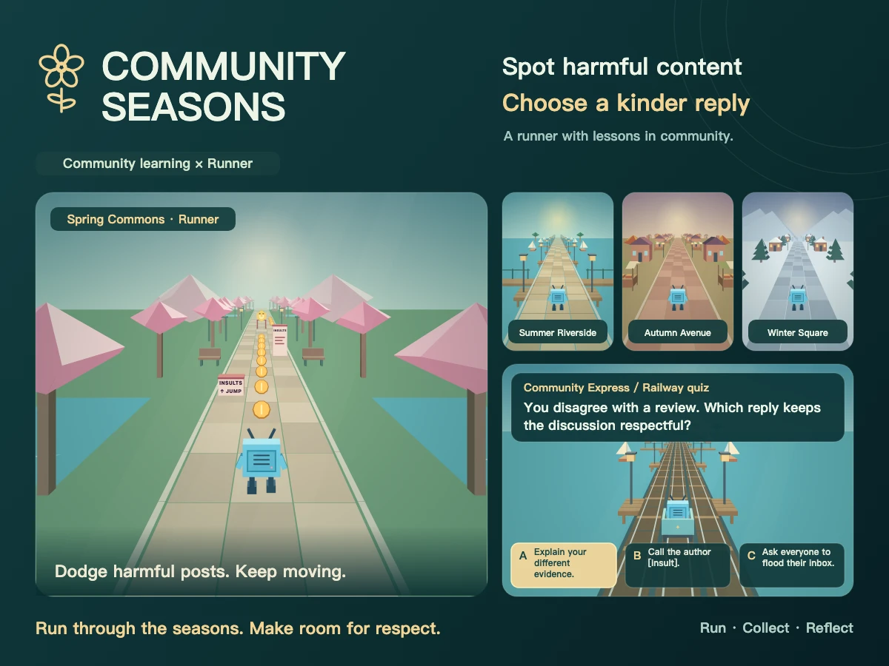

# Community Seasons / 四季共建

[English](README.md) | [简体中文](README.zh-CN.md)

[](https://www.bilibili.com/toy/community-seasons/index.html)

[](https://github.com/g497813927/community-seasons/pulls)
[](https://github.com/g497813927/community-seasons/issues)
[](https://github.com/g497813927/community-seasons/actions/workflows/ci.yml?query=branch%3Amain+event%3Apush)
[](LICENSE)
[](src/public/THIRD-PARTY-NOTICES.txt)

Community Seasons is a runner about online community literacy. Travel through four seasons, dodge harmful posts, and learn to choose kinder responses through short explanations and railway quizzes.

Play in English or Simplified Chinese with keyboard/WASD or touch/swipe controls. Built with React, TypeScript and Vite, the game runs standalone without a server account, API key or database.



## Quick start

Install **Node.js 24** (the version in [`.nvmrc`](.nvmrc)), then run:

```sh
git clone https://github.com/g497813927/community-seasons.git
cd community-seasons
npm run setup
npm run dev -- --port 3001
```

Open [http://127.0.0.1:3001](http://127.0.0.1:3001). If you already have the repository, start with `npm run setup` from its root. Setup installs the exact locked dependencies for both the QA workspace and game.

Run all commands below from the repository root. Edit the game in `src/`; every test and QA fixture imports that same source.

For controls, saved progress and game rules, see the [game README](src/README.md) and [gameplay guide](src/GAMEPLAY.md).

## Deploy your own copy

[](https://vercel.com/new/clone?repository-url=https%3A%2F%2Fgithub.com%2Fg497813927%2Fcommunity-seasons)

Keep Vercel's Root Directory at the repository root; the included configuration handles installation and the production build. No environment variables or secrets are required. This hosted copy saves progress locally in each browser.

## Test and build

```sh
npm test                # Deterministic regressions
npm run test:types      # Typecheck property-test generators
npm run test:fuzz       # One bounded round of quick fuzz tests
npm run build           # Validate and build the production game
```

The build synchronizes the question bank, regenerates third-party notices, checks types and writes `src/dist/`. Preview that build locally with:

```sh
npm --prefix src run preview -- --port 4173
```

Open [http://127.0.0.1:4173](http://127.0.0.1:4173). Only `src/dist/` is a production artifact; QA fixtures, debug controls and QA URL switches must stay out of releases.

For a reproducible fuzz run or the full bounded suite:

```sh
node tests/fuzz/run.mjs quick --seed 3231321585
node tests/fuzz/run.mjs full
```

See the [QA guide](docs/QA.md) for browser and physical-device checks, and the [fuzzing guide](docs/FUZZING.md) for suite options and failure replay. Browser QA uses dedicated fixture servers and isolated saves. Phone QA requires a connected, unlocked device and an explicitly selected test preview. Python 3.8+ is only needed for the optional `tests/fuzz/fuzz_game.py` launcher.

## Project layout

| Path | Contents |
| --- | --- |
| `src/` | Game source, translations, question bank, assets and build configuration |
| `tests/` | Automated tests and Web/Android/iOS QA; see the [test maintenance guide](tests/README.md) |
| `docs/` | QA, fuzzing, validation and release notes |
| `snapshot.json` | Historical import baseline for reproducibility; runs record current source hashes |

`src/` contains the game; all test suites and QA tools live under `tests/`. See the [test maintenance guide](tests/README.md) for the suite layout and launchers. Generated builds, installed dependencies and test results are ignored by Git.

## Making changes

Read [AGENTS.md](AGENTS.md), the [QA guide](docs/QA.md) and the game documentation before changing behavior. Preserve both languages, keyboard and touch controls, accessibility and enlarged-text layouts. Keep QA save namespaces separate from player and Toy cloud saves.

- **Questions:** submit a new question or correction through the [railway question issue form](https://github.com/g497813927/community-seasons/issues/new?template=rail-question.yml); no cloning or JSON editing is needed. Submit one complete bilingual question per issue. Automated feedback checks its structure; maintainers review the content, integrate accepted questions into the JSON bank, and synchronize it. See the [question-bank guide](src/QUESTION_BANK.md) for fields, limits and maintainer checks.
- **Dependencies:** keep versions locked and run `npm --prefix src run licenses:generate` after updates. The in-game notices remain inline without hyperlinks; see the [license generator guide](src/scripts/LICENSE_GENERATOR.md).
- **Failures:** keep the failure log, seed, shrink path and source hashes together before rerunning. Fuzz tests exercise the current source; do not edit it during a stress session.
- **Releases:** follow the [release guide](docs/RELEASE.md). Deployment and GitHub pushes require authorization. Existing Toy releases use password access; content-only updates must preserve the existing password, and credentials must never be committed.

The game's own source code is licensed under the [MIT License](LICENSE). Third-party dependencies retain their own licenses; their notices are included separately.
