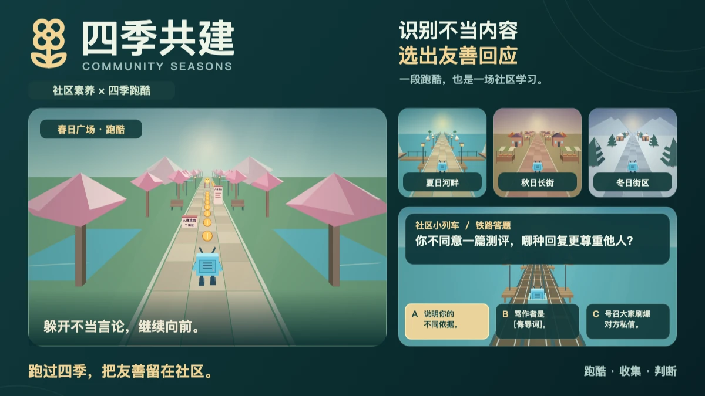

# Community Seasons / 四季共建

[English](README.md) | [简体中文](README.zh-CN.md)

[](https://www.bilibili.com/toy/community-seasons/index.html)

[](https://github.com/g497813927/community-seasons/pulls)
[](https://github.com/g497813927/community-seasons/issues)
[](https://github.com/g497813927/community-seasons/actions/workflows/ci.yml?query=branch%3Amain+event%3Apush)
[](LICENSE)
[](src/public/THIRD-PARTY-NOTICES.txt)

《四季共建》将网络社区素养学习融入四季跑酷：躲避不当言论，通过案例讲解和铁路答题识别有害内容，练习更友善的回应。

游戏支持英语和简体中文，可通过键盘/WASD 或触屏滑动操作。使用 React、TypeScript 和 Vite 开发，独立运行时无需服务器账号、API 密钥或数据库。



## 快速开始

安装 **Node.js 24**（版本见 [`.nvmrc`](.nvmrc)），然后运行：

```sh
git clone https://github.com/g497813927/community-seasons.git
cd community-seasons
npm run setup
npm run dev -- --port 3001
```

打开 [http://127.0.0.1:3001](http://127.0.0.1:3001)。如果已经克隆了仓库，请在仓库根目录从 `npm run setup` 开始执行。安装命令会为 QA 工作区和游戏安装锁文件中指定的精确依赖版本。

下文所有命令均在仓库根目录执行。游戏代码位于 `src/`，所有测试和 QA 测试页面都直接使用这份源码。

操作方式、存档和游戏规则请参阅[游戏说明](src/README.zh-CN.md)和[玩法指南](src/GAMEPLAY.zh-CN.md)。

## 部署自己的副本

[](https://vercel.com/new/clone?repository-url=https%3A%2F%2Fgithub.com%2Fg497813927%2Fcommunity-seasons)

保留 Vercel 的默认根目录（仓库根目录），项目配置会完成依赖安装和正式版构建。无需配置环境变量或密钥；此托管副本在各浏览器本地保存进度。

## 测试与构建

```sh
npm test                # 确定性回归测试
npm run test:types      # 属性测试生成器的类型检查
npm run test:fuzz       # 执行一轮有限的快速模糊测试
npm run build           # 校验并构建正式版游戏
```

构建过程会同步题库、重新生成第三方许可声明、检查类型，并将产物写入 `src/dist/`。使用以下命令在本地预览构建结果：

```sh
npm --prefix src run preview -- --port 4173
```

打开 [http://127.0.0.1:4173](http://127.0.0.1:4173)。只有 `src/dist/` 是正式发布产物；QA 测试页面、调试控制和 QA URL 参数开关不得进入发布版本。

需要可复现的模糊测试，或执行一轮完整测试时，可运行：

```sh
node tests/fuzz/run.mjs quick --seed 3231321585
node tests/fuzz/run.mjs full
```

浏览器与真机检查请参阅 [QA 指南](docs/QA.zh-CN.md)，测试套件选项及失败重放请参阅[模糊测试指南](docs/FUZZING.zh-CN.md)。浏览器 QA 使用独立的测试服务器和隔离存档。手机 QA 需要已连接且解锁的设备，并明确选定测试预览。仅在使用可选的 `tests/fuzz/fuzz_game.py` 启动器时才需要 Python 3.8+。

## 目录结构

| 路径 | 内容 |
| --- | --- |
| `src/` | 游戏源码、翻译、题库、资源和构建配置 |
| `tests/` | 自动化测试与网页/Android/iOS QA；详见[测试维护指南](tests/README.zh-CN.md) |
| `docs/` | QA、模糊测试、验证记录和发布说明 |
| `snapshot.json` | 用于复现的历史导入基线；每次测试都会记录当前源码的哈希值 |

`src/` 保存游戏代码；所有测试套件与 QA 工具统一放在 `tests/`。套件分工和启动方式见[测试维护指南](tests/README.zh-CN.md)。构建产物、已安装的依赖与测试结果均由 Git 忽略。

## 修改与维护

修改行为前，请阅读 [维护约定](AGENTS.zh-CN.md)、[QA 指南](docs/QA.zh-CN.md)和游戏文档。保留两种语言、键盘和触屏操作、无障碍支持及大字号布局。QA 存档的命名空间必须与玩家存档和 Toy 云存档隔离。

- **题库**：通过[铁路题目 Issue 表单](https://github.com/g497813927/community-seasons/issues/new?template=rail-question.yml)提交新题或修订，无需克隆仓库或编辑 JSON。每个 Issue 提交一道完整双语题目。自动反馈检查结构；维护者审阅内容，将采纳的题目整合进 JSON 题库并同步。字段、长度限制与维护者检查步骤见[题库指南](src/QUESTION_BANK.zh-CN.md)。
- **依赖**：锁定依赖版本，更新后运行 `npm --prefix src run licenses:generate`。游戏内的许可声明须直接展示原文，不包含超链接；详见[许可生成器指南](src/scripts/LICENSE_GENERATOR.zh-CN.md)。
- **测试失败**：重新运行前，将失败日志、随机种子、收缩路径和源码哈希值一并保存。模糊测试使用当前源码，压力测试期间不要修改源码。
- **发布**：遵循[发布指南](docs/RELEASE.zh-CN.md)。部署和 GitHub 推送均需要授权。仅更新内容时必须保留现有发布设置，且不得提交凭据。

游戏自身源码采用 [MIT 许可证](LICENSE)。第三方依赖仍遵循各自的许可证，其许可声明单独提供。
